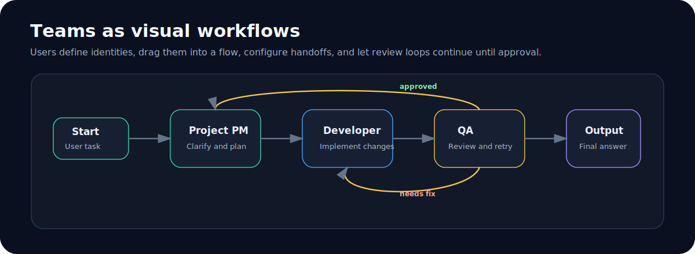

# Claude Code Studio Next

> Local-first desktop studio for Claude Code: providers, identities, Skills, Teams workflows, MCP services, task runs, diagnostics, and project history in one native app.


[](https://github.com/Jevil961/claude-code-studio-next/actions/workflows/ci.yml)
[](https://github.com/Jevil961/claude-code-studio-next/actions/workflows/release.yml)


## What This Is

Claude Code Studio Next is a desktop command center for people who use Claude Code across multiple projects, providers, Skills, MCP servers, and working roles.

Instead of switching between terminal windows, scattered config files, and hidden process state, the app gives you one place to:

- choose providers and models
- define reusable identities
- build Teams workflows with handoffs and review loops
- manage Skills and MCP services
- browse project sessions and task history
- run diagnostics before packaging or release
- keep local data under your control

## Core Experience



| Area | What it does |
| --- | --- |
| Chat workspace | Submit tasks, attach context, review output, and keep project sessions organized. |
| Providers | Configure LLM providers, model choices, and runtime defaults. |
| Identities | Save role-specific behavior such as project manager, developer, tester, reviewer, or custom expert. |
| Teams | Visually compose multi-role workflows with conditional handoffs and final approval. |
| Skills | Discover, preview, sync, and bind Skills to identities. |
| MCP | Manage local tool servers used by Claude Code workflows. |
| Task center | Track agent tasks, review diffs, replay sessions, and inspect run state. |
| Diagnostics | Check runtime health, bundled dependencies, bridge availability, and release readiness. |

## Why It Is Different

- **Visual Teams workflows**: define role-to-role handoffs instead of writing one long prompt.
- **Identity-first operation**: switch behavior by role, not by manually editing prompts and Skills every time.
- **Local-first design**: configuration, backups, project cache, diagnostics, and history stay on your machine.
- **Desktop-grade control**: Tauri shell, local backend, process cleanup, and packaged runtime support.
- **Release-oriented tooling**: smoke tests, diagnostics, packaging checks, and platform-specific builds.
- **Safer defaults**: first-run guidance, empty-state actions, CSP, path guards, and plugin input validation.

## Installation


Download the latest package from [GitHub Releases](https://github.com/Jevil961/claude-code-studio-next/releases).

| Platform | Package |
| --- | --- |
| Windows x64 | `*_x64-setup.exe` or portable zip |
| Windows ARM64 | `*_arm64-setup.exe` when available |
| macOS Intel | signed and notarized `*_x64.dmg` |
| macOS Apple Silicon | signed and notarized `*_aarch64.dmg` or `*_arm64.dmg` |
| Linux x64 | `*_amd64.AppImage` or `*_amd64.deb` |
| Linux ARM64 | `*_arm64.AppImage` or `*_arm64.deb` |

Requirements:

- Claude Code installed or installable through the app guidance.
- Packaged desktop builds include the app runtime needed to launch the studio.
- System Node.js/npm may still be needed for npm-based Claude Code installation or updates.

## Architecture


The app uses a Tauri desktop shell, a local Node backend, SQL.js-backed local data, and short-lived Claude Code runner processes. The frontend stays responsive while the backend handles providers, Skills, MCP services, Teams, session indexing, diagnostics, backups, and task orchestration.

## Quick Start For Users

1. Open the app and follow the first-run wizard.
2. Add or select a Provider.
3. Choose a project folder.
4. Create an Identity or use an existing one.
5. Build a Team workflow if the task needs multiple roles.
6. Submit a task from the main input box or Teams run panel.

For a user-facing guide, see [docs/USER_GUIDE.md](docs/USER_GUIDE.md).

## Development

```powershell
npm install
npm run dev
```

Validation:

```powershell
npm run check
npm test
cargo check --manifest-path src-tauri\Cargo.toml
```

Packaging:

```powershell
npm run release:check
npm run build:installer
npm run build:portable
```

## Documentation

- [User Guide](docs/USER_GUIDE.md)
- [Project Structure](docs/PROJECT_STRUCTURE.md)
- [Runtime Strategy](docs/RUNTIME.md)
- [Performance Budget](docs/PERFORMANCE_BUDGET.md)
- [Release Checklist](docs/RELEASE_CHECKLIST.md)
- [Release Notes 1.0.0](docs/RELEASE_NOTES_1.0.0.md)
- [Contributing](CONTRIBUTING.md)
- [Security](SECURITY.md)

## Privacy Note

This repository is published with neutral project commit metadata. Do not commit personal names, private emails, API keys, local machine paths, or screenshots containing secrets.

## License

Released under the [MIT License](LICENSE).
