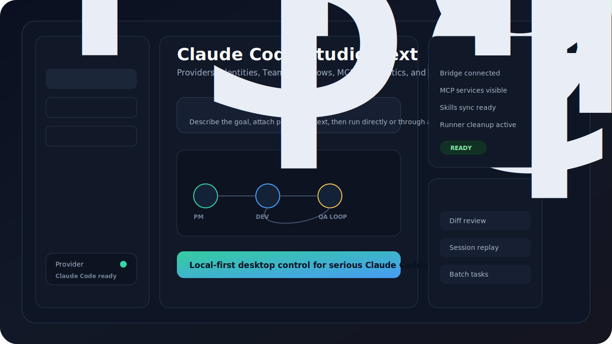
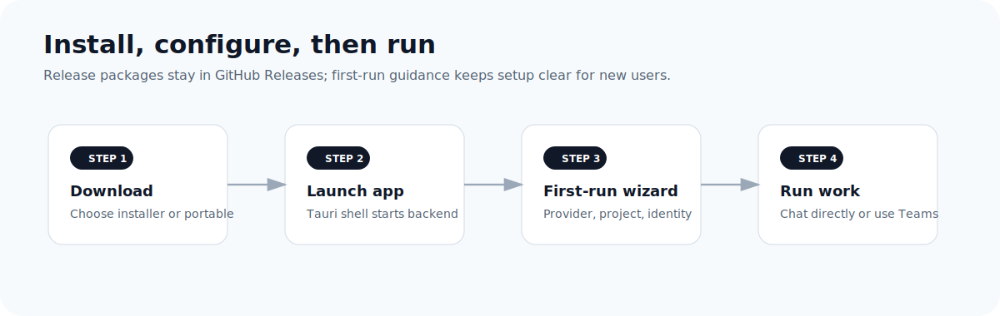
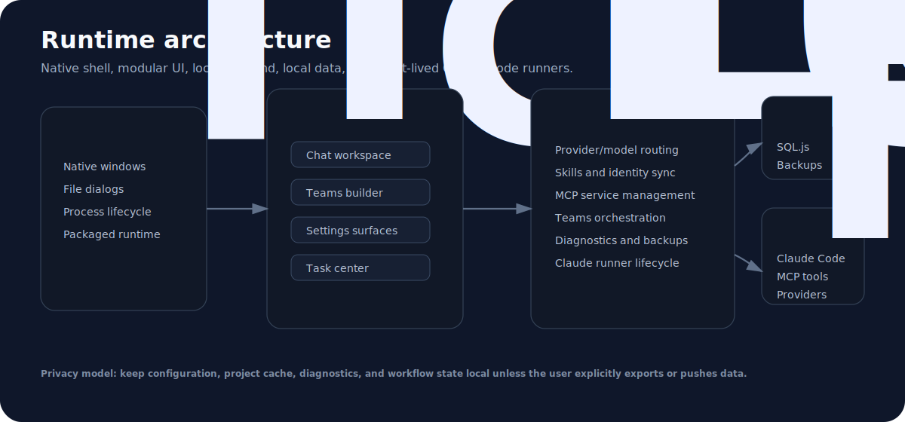

# Claude Code Studio Next

> A local-first desktop control center for Claude Code, built for providers, Skills, MCP services, project memory, diagnostics, and clean task execution.



[](https://github.com/Jevil961/claude-code-studio-next/actions/workflows/ci.yml)
[](https://github.com/Jevil961/claude-code-studio-next/actions/workflows/release.yml)


## Why It Exists

Claude Code is most useful when it has the right provider, the right model, the right Skills, the right MCP services, and a clean project context. In real daily use, those pieces can become scattered across settings files, terminal sessions, project folders, and process lists.

Claude Code Studio Next turns that operational layer into a focused desktop workspace. It helps power users run Claude Code with less friction, stronger organization, and fewer leftover background processes.

## What Makes It Different

- **One command center for Claude Code**: providers, model presets, Skills, MCP services, projects, conversations, diagnostics, and usage visibility live in one place.
- **Identity-based workspaces**: organize Skills around roles or working modes instead of manually reshuffling files each time.
- **MCP service hub**: manage local tool servers from a visual surface instead of treating MCP configuration as hidden plumbing.
- **Project memory navigation**: browse Claude Code projects and conversations without digging through raw history folders.
- **Calmer desktop experience**: Claude tasks run as controlled work sessions, then clean up after completion.
- **Local-first ownership**: settings, backups, cache, and diagnostics stay on the user's machine.
- **Recovery by default**: risky settings and Skills writes are backed up before they happen.
- **Cross-platform distribution**: Windows, macOS, and Linux are part of the release plan, with x64 and ARM64 builds handled separately.

## Platform Support

| Operating system | CPU architecture | Package style |
| --- | --- | --- |
| Windows 10/11 | x64, ARM64 | Installer and portable package |
| macOS | Intel x64, Apple Silicon ARM64 | Signed and notarized DMG |
| Linux | x64, ARM64 | AppImage and Debian package |

## Installation



Download the latest build from [GitHub Releases](https://github.com/Jevil961/claude-code-studio-next/releases).

macOS packages are published only after Developer ID signing and Apple notarization are configured. This avoids the "app is damaged" Gatekeeper experience after download.

| Platform | Choose this package |
| --- | --- |
| Windows x64 | `*_x64-setup.exe` or portable zip |
| Windows ARM64 | `*_arm64-setup.exe` when available |
| macOS Intel | signed and notarized `*_x64.dmg` |
| macOS Apple Silicon | signed and notarized `*_aarch64.dmg` or `*_arm64.dmg` |
| Linux x64 | `*_amd64.AppImage` or `*_amd64.deb` |
| Linux ARM64 | `*_arm64.AppImage` or `*_arm64.deb` |

Requirements:

- Claude Code installed, or available to install through the app guidance.
- Packaged desktop builds include the runtime needed to launch the app.
- System Node.js/npm may still be needed for installing or updating Claude Code through npm-based workflows.

## Product Tour



Claude Code Studio Next uses Tauri for the desktop shell and a local backend for Claude Code operations. The application is designed to keep the UI responsive while giving users practical control over project context, provider selection, Skills, MCP services, diagnostics, and task lifecycle.

## Documentation

- [English full article](docs/i18n/README.en.md)
- [中文完整介绍](docs/i18n/README.zh-CN.md)
- [Article complet en français](docs/i18n/README.fr.md)
- [Artículo completo en español](docs/i18n/README.es.md)
- [Полное описание на русском](docs/i18n/README.ru.md)
- [المقال الكامل بالعربية](docs/i18n/README.ar.md)
- [Project Structure](docs/PROJECT_STRUCTURE.md)
- [Runtime Strategy](docs/RUNTIME.md)
- [Performance Budget](docs/PERFORMANCE_BUDGET.md)
- [Release Checklist](docs/RELEASE_CHECKLIST.md)
- [Contributing](CONTRIBUTING.md)
- [Security](SECURITY.md)

## Development

```powershell
npm install
npm run dev
```

Validation:

```powershell
npm run check
npm test
cargo check --manifest-path src-tauri\Cargo.toml
```

## Roadmap

- Smooth first-run setup for Node.js and Claude Code.
- Optional bundled runtime for a more consumer-friendly installer.
- Signed releases and automatic updates.
- More visual controls for MCP and Skills workflows.
- Broader release validation across ARM devices.

## License

Released under the [MIT License](LICENSE).
